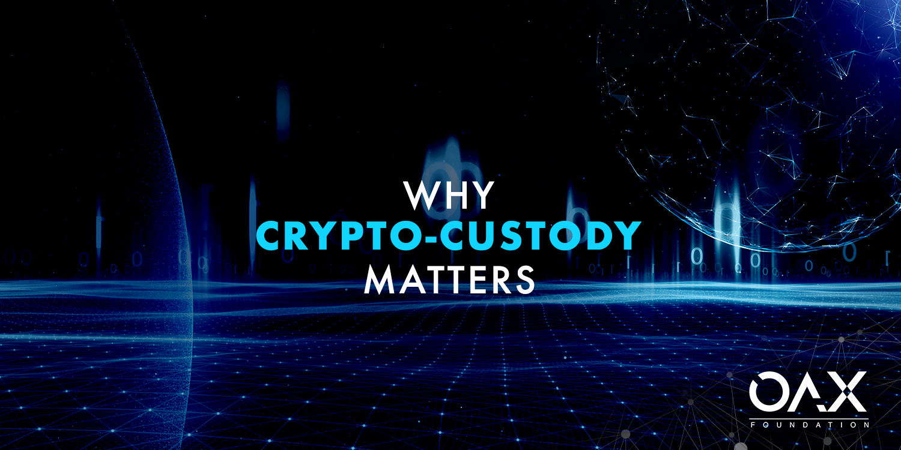

<figure>
	
</figure>

_By Amanda Liu, General Manager and Kelvin Wong Senior Marketing Advisor_  

Those of you who have been following OAX Foundation would know that one of our main goals is to promote digital asset trading to the mainstream. For this to happen, it is our belief that the industry needs to work together to build a proper ecosystem.

To put it another way, to help trading activities in this new asset class thrive, we need more than exchange operators. As mentioned in our previous blogs, providers of services and technologies such as trade surveillance, Know-Your-Customer (KYC), and digital wallets are all critical elements if digital asset trading is to become a meaningful part of finance.

One other critical area is crypto-custody. The case for this has again been amplified this week by what turns out to be the biggest news rocking the digital asset industry this year. On April 25, several news outlets reported that crypto exchange Bitfinex has allegedly lost US$ 850 million and used funds from affiliated stablecoin operator Tether to cover the loss.

In an open letter, CEO Jean Louis van der Velde claimed that the petition filed by the New York Attorney General’s office was “filled with inaccuracies and false assertions.” He also maintains that the funds are not lost but are seized and safeguarded, expressing optimism in the company’s ability to recover those funds.

Regardless of the outcome, many commentators are now predicting further fund outflows from cryptocurrency exchanges as more investors question the safety of their assets.

On the other hand, some believe that this is a good opportunity for the industry to reflect on structural issues hindering mass adoption of digital assets. In an opinion piece published by Coindesk, executives at cryptocurrency investment firm Pactum Capital pointed out that the current saga highlighted the lack of proper compliance and custody standards for crypto.

We couldn’t agree more. Ever since the fiasco of Mt. Gox, the crypto exchange that claimed to have lost about 650,000 bitcoins to theft in the early days of digital asset trading, those with clearer vision have already called for the industry to look into better ways for exchanges to safeguard clients’ assets.

The good news is that lately, exchanges and technology companies alike are launching more initiatives to tackle this area. BC Group, the Hong Kong-based owner of ANXONE and OSL, said in April it would launch Asia’s first insured custody service for digital assets.

During the same month, Bakkt, another crypto exchange, said that it has acquired Digital Asset Custody Company, a custodian of digital assets. In March, Shuttle Holdings, a New York-based investment firm, launched the beta version of a custody solution for digital assets built on IBM’s private cloud and encryption technologies. The solution can be used by exchanges, banks, brokers, funds, custodians or any investors who want to do self-custody.

With more players joining the race to come up with safer and more reliable custody solutions, it may also open the door for more institutional investment to come into the space, bringing us closer to our goal of mass adoption of digital assets.
  

**Got a Question?**

Want to know the latest from OAX Foundation?

More about OAX Foundation

Website: www.oax.org

Medium: medium.com/@OAX_Foundation  
  

**Reach out to OAX Foundation via e-mail:**

Collaboration Proposals: ProjectStallman@oax.org

Other Inquiries: Info@oax.org

Social Media:

Discord: discord.gg/ZH5YHkb

Youtube: bit.ly/2Bvsk73

Twitter: twitter.com/OAX_Foundation

LinkedIn: www.linkedin.com/company/oax-foundation/

BitcoinTalk: bitcointalk.org/index.php?topic=1943946

Reddit: www.reddit.com/r/OpenANX/

Telegram English: t.me/openanxteam

Telegram Chinese: t.me/oax_cn
